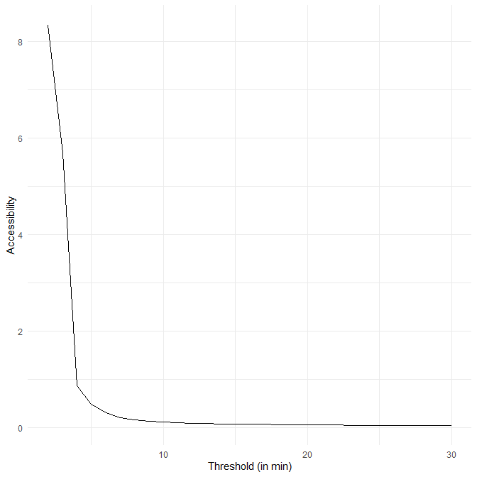
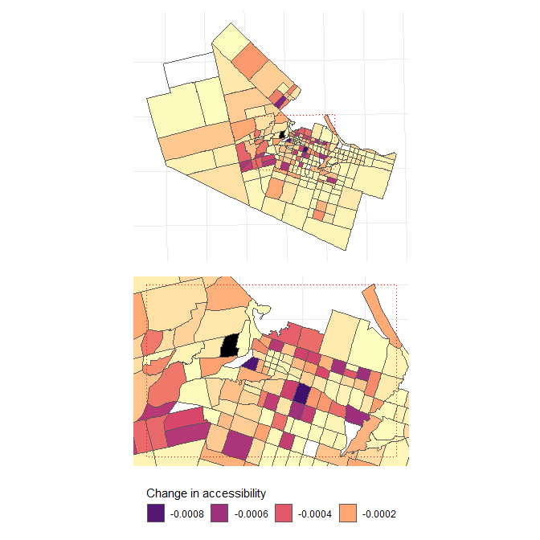
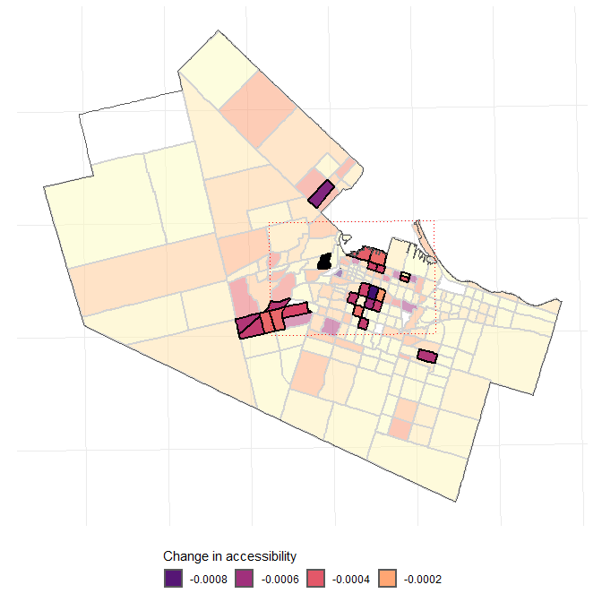

<!-- README.md is generated from README.Rmd. Please edit that file -->

# Changes in accessibility to food banks and food services during COVID-19 and implications for low income populations in Hamilton, Ontario

<!-- badges: start -->
<!-- badges: end -->

Christopher D. Higgins (University of Toronto Scarborough)  
Antonio Páez (McMaster University)  
Gyoorie Kim (University of Toronto Mississauga)  
Jue Wang (University of Toronto Mississauga)

Paper submitted to *Social Science and Medicine*

## Abstract

In this paper we analyze the changes in accessibility to emergency and
community food services before and during the COVID-19 pandemic in the
City of Hamilton, Ontario. Many of these food services are the last line
of support for households facing food insecurity; as such, their
relevance cannot be ignored in the midst of the economic upheaval caused
by the pandemic. Our analysis is based on the application of balanced
floating catchment areas and concentrates on households with lower
incomes (&lt;CAD40,000, approximately the Low Income Cutoff Value for a
city of Hamilton’s size). We find that accessibility was low to begin
with in suburban and exurban parts of the city; furthermore, about 14%
of locations originally available in Hamilton closed during the
pandemic, further reducing accessibility. The impact of closures on the
level of service of the remaining facilities, and on accessibility, was
disproportionate, with system-wide losses exceeding 40%. Those losses
were geographically and demographically uneven. While every part of the
city faced a reduction in accessibility, inner suburbs fared worse in
terms of loss of accessibility. As well, children (age
)
appear to have been impacted the most.

## Keywords

-   Food insecurity  
-   Emergency food services  
-   Community food services  
-   Food banks  
-   Accessibility  
-   Balanced Floating Catchment Areas  
-   COVID-19  
-   Hamilton  
-   Ontario
-   Reproducible research

# Introduction

Food insecurity is defined as an “inadequate or uncertain access to a
sufficient quantity and/or adequate quality of food” due to a
household’s financial limitations (Enns et al. 2020). This condition has
been associated with reductions in nutritional outcomes (Bhattacharya,
Currie, and Haider 2004; Kirkpatrick and Tarasuk 2008; Olson 1999) and
negative physical and mental health impacts in children and adults
(Elgar et al. 2021; Jones 2017; Ramsey et al. 2011; Seligman, Laraia,
and Kushel 2010; Stuff et al. 2004). Over at least the past four decades
food banks and related services have become an essential line of defense
against food insecurity in Canadian communities (Riches 2002; Holmes et
al. 2018; Black and Seto 2020; Tarasuk, Fafard St-Germain, and Loopstra
2020). In this respect, Canada is not unlike numerous other wealthy
countries where a systematic dismantling of the welfare state took place
in the intervening period (Tarasuk, Dachner, and Loopstra 2014).

The emergence of COVID-19, the worst public health crisis since the 1918
flu pandemic, has exposed important social and economic fault lines, and
pre-existing patterns of inequality appear to have been exacerbated.
Along several other dimensions of stress (e.g., accessibility to health
care facilities, Ghorbanzadeh et al. 2021; Pereira, Braga, et al. 2021),
this seems to be the case for food insecurity as well (Laborde, Martin,
and Vos 2020). According to Statistics Canada (2020b), in the early
stages of the pandemic almost 15% of individuals reported living in a
household that faced food insecurity; the risk of food insecurity was
substantially higher for households with children. The difference
between households with and without children was significant, and 11.7%
of households with children indicated that “food didn’t last and \[there
was\] no money to get more” sometimes or often, compared to 7.3% of
households without children; likewise, 13% of households with children
indicated that they “\[c\]ouldn’t afford balanced meals” sometimes or
often, compared to 8.8% of households without children. Additionally,
Men and Tarasuk (2021) report that about 25% of individuals who
experienced job insecurity (a relatively common occurrence during the
pandemic) also experienced food insecurity associated with COVID-related
disruptions to employment, financial hardship, and use of food charity.

The impacts of food insecurity during the pandemic are alarming, since
diet-related diseases, such as obesity, heart-disease, and diabetes,
were already critical public health concerns in Canada prior to COVID-19
(Boucher et al. 2017). While emergency food services are not necessarily
a stable solution to food insecurity and in fact may encourage a
retrenchment of neoliberal policy (Wakefield et al. 2013), in reality
provide a resource of last instance to households in precarious
situations (Bazerghi, McKay, and Dunn 2016). As a mid-size city
grappling with deindustrialization, Hamilton exhibits high rates of
poverty and use of emergency food services. As recently as 2019, the
Hamilton Hunger Report (HFS 2019) noted that food banks in the city
recorded the highest number of visitors in the past 29 years; a rate of
increase greater than population growth. Most troubling, approximately
40% of all visitors were children.

It is known that urban food environments, within which people make their
daily food choices, are essential in influencing eating behaviours and
health outcomes, based on factors such as food availability, ease of
geographic accessibility and socio-demographic variations (A. Paez et
al. 2010; Vanderlee and L’Abbé 2017; Widener 2018). However, while there
is a wealth of literature that has examined the topic of geographic
accessibility to healthy food through the “food desert” concept, there
has been little research into accessibility to emergency and community
food services. Previous work has explored differences in *accessing*
food banks, such as how some households utilize food banks over short
periods of time while others regularly utilize food banks as longer-term
resource (e.g., Enns et al. 2020). In addition, transportation and
locational considerations have been raised as key issues in food bank
accessibility in previous qualitative research (Smith-Carrier et al.
2017). However, we are not aware of any research that has focused on
estimating or capturing this geographic component of accessibility.

The study of place-based geographic accessibility is concerned with
capturing the potential to reach destinations of value using the
transportation network (Páez, Scott, and Morency 2012). Indeed, the
Government of Canada’s recent Food Policy (Agriculture and Canada 2019)
has made “access” to healthy food a priority for Canadian communities
and previous research suggests that such accessibility plays a key role
in user satisfaction with food bank service delivery (Holmes et al.
2018). However, as with research into the prevalence of food deserts,
accessibility to food banks is unlikely to be evenly distributed, and
variation throughout a city can be expected due to transportation
network characteristics and the spatial distribution of service
locations and the population they are meant to serve. Furthermore,
policy responses to the COVID-19 pandemic likely have added to the
distress of vulnerable households. Non-pharmaceutical interventions
during the pandemic involving restrictions in mobility have increased
the friction of travel, in particular by transit on which low income
populations are more reliant (e.g., DeWeese et al. 2020). At the same
time, the pandemic has created additional stress for the operators of
food banks through disruptions in the supply chain (e.g., McKay,
Bastian, and Lindberg 2021) as well as concerns surrounding the delivery
of service in safe conditions and possible cancellation of food service
programs.

For this study, we aim to look at how the landscape of emergency food
and related services (e.g. low-cost or free meal service providers)
available in Hamilton, Ontario, changed during the pandemic. Did the
number of open services diminish? If so, what was the accessibility to
emergency and community food services before the pandemic from the
perspective of low income households, and how has it changed during the
pandemic with respect to geographic access and congestion at remaining
sites? And finally, who are most likely to have been impacted by changes
in the accessibility landscape? This paper first looks at the
distribution of emergency and community food services before and during
the pandemic. Then, we use the balanced floating catchment area approach
of Paez et al. (2019) to investigate the accessibility situation. For
this, we adopt a fully disaggregated approach based on parcel-level
data. Socio-economic and demographic data are drawn from the latest
Census of Canada (2016), whereas travel information is from the most
recent regional travel survey from 2016. This paper follows reproducible
research recommendations (see Brunsdon and Comber 2020), and the
research was conducted using open source tools for transportation
analysis (Lovelace 2021). The data and code needed to reproduce the
analysis are available in an (anonymous) [Drive
Folder](https://drive.google.com/drive/folders/1-l8hO1pMIqaBqf57j_M_BMrXhXFvrV2c?usp=sharing).

# Food Insecurity and Emergency and Communal Food Services in Canada

Food insecurity is the inability to acquire and consume an adequate
amount or good quality food, leading to inadequate nutrient intake
(Kirkpatrick and Tarasuk 2008) and poorer physical and mental health
outcomes (Ramsey et al. 2011; Seligman, Laraia, and Kushel 2010; Stuff
et al. 2004). In this regard, food insecurity is a major population
health concern, particularly among Canadians at socio-economic
disadvantage (Bazerghi, McKay, and Dunn 2016). Official government
surveys such as the Household Food Security Survey Module (HFSSM), the
Canadian Community Health Surveys (CCHS), the Longitudinal and
International Study of Adults (LISA), and official classifications
determined by Health Canada in relation to socio-demographic variables
offer some insight into food insecurity in Canada (Kirkpatrick and
Tarasuk 2008; Tarasuk and Vogt 2009; Gundersen et al. 2018).

Nationally, analysis of the 2011-2012 CCHS has previously revealed that
food insecurity impacts approximately 12.3% of Canadian households
(Tarasuk, Dachner, and Loopstra 2014). Using the same data, Tarasuk et
al. (2019) found higher odds of food insecurity amongst households
relying on social assistance, those without a university degree or with
children under the age of 18, and individuals that lived alone, renters,
and those identifying as Aboriginal. While surveys revealed that only 20
to 30 percent of those experiencing food insecurity were found to
frequent food banks in Canada (Tarasuk, Dachner, and Loopstra 2014),
pre-pandemic research from Ottawa (Enns et al. 2020) and Vancouver
(Black and Seto 2020) suggests that long-term users tend to be older,
have health or mobility challenges, live in large households, and are
less likely to have employment income. In terms of geography, previous
research conducted at the provincial scale using data from the 2011-2012
CCHS found that the prevalence of food insecurity ranged across the
country from 11.8% of households in Ontario to 41% of households in
Nunavut (Tarasuk, Fafard St-Germain, and Mitchell 2019).

Food banks - sometimes also referred to as ‘food pantries’ and ‘food
shelves’ - originated as a community response to aid those with
inadequate food by voluntarily offering them meals and ingredients
(Riches 2002; Loopstra and Tarasuk 2012). Although in their origin food
banks were meant to provide a temporary solution to accommodate those in
hunger due to job retrenchments and economic downfalls since the 1980s,
over time many have evolved into a community practice to secure food
supplies for those in need (Loopstra and Tarasuk 2012; Wakefield et al.
2013). In Canada, the number of food banks has steadily increased in the
past few decades (Wakefield et al. 2013). The largest database of food
banks and their use comes from the non-profit association Food Banks
Canada (FBC), which conducts an annual assessment through its affiliated
members. FBC’s 2018 Hunger Count report (FBC 2018) (the most recent
available) listed 1,830 member food banks across the country, and found
that Canadians visited food banks 1.1 million times in March of 2018. Of
those accessing food banks, certain population characteristics tend to
be over-represented compared to national totals from the 2016 Canadian
Census of Population. According to FBC’s 2018 data, single-adult
households represent 45% of those utilizing food banks despite making up
28% of Canada’s population, 19% are single-parent households (compared
to 10% nationally), and 35% of those using food bank services are
children aged 0-18 even though their share of Canada’s national
population is approximately 20%. In addition, 59% of households
accessing food banks list social or disability assistance as their
primary source of income.

The COVID-19 pandemic has led to an increase in the number of households
living in food insecurity in Canada. Survey results from Statistics
Canada from May of 2020 suggest that 14.7% of the population was living
in food insecurity in the past 30 days, up from 10.5% in 2017-2018
(Statistics Canada 2020b). Recent data from FBC (FBC 2020) showed that
52% of member food banks reported an increase in usage in March of 2020
when initial lockdown restrictions were put in place across much of the
country. The pandemic also created significant staffing issues with 42%
of food banks reporting a reduction in volunteers. However, 53% of food
banks later reported a decrease in use into the summer of 2020 which FBC
members attributed to emergency financial support programs from the
federal government. Nevertheless, some of these benefit programs were
temporary. Although more recent statistics on food bank use in Hamilton
in 2020 and 2021 are not yet available, data from the Daily Bread Food
Bank (DBFB 2020) in neighbouring Toronto for August 2020 shows visits
climbing 51% year-over-year in that city, which suggests that many
households in Hamilton are likely to turn to food bank services to meet
their needs.

Beyond traditional conceptualizations of food banks as providers of
emergency food assistance, other community food services also play an
important role in decreasing food insecurity. The scope and objectives
of food banks can vary by region and by country, and these organizations
can include not only prepared meals and aliments for emergency food
supply, but also shared spaces to connect in community gardens and
community kitchens (Wakefield et al. 2013). However, the efficacy of
these programs in reducing food insecurity differs by the type of
service offered. For example, previous qualitative research in the
Toronto region has questioned the capacity of community kitchens to
improve the food security of low-income households due to their limited
scale of operations, and un-subsidized kitchens were found to be
particularly inaccessible to to families living in severe poverty
(Tarasuk and Reynolds 1999). However, other food access options such as
no-cost or low-cost meals provided through community meals or congregate
dining play an important role in decreasing food insecurity. Research in
Minnesota found that seniors experiencing food insecurity valued
congregate dining for providing affordable meals and a space for social
gathering (Oemichen and Smith 2016). Furthermore, because seniors paid
for the meal, there was no stigma attached to the use of these services
compared to traditional food-purchasing assistance such as the
Supplemental Nutrition Assistance Program.

While previous research has examined the characteristics of individuals
and households accessing emergency and community food services, the
locational or transportation accessibility aspect of food bank access is
not well understood. A wealth of literature examining the food desert
concept suggests that, in addition to socio-economic and demographic
factors, location and transportation networks play a key role in a
household’s accessibility to healthy foods (A. Paez et al. 2010;
Vanderlee and L’Abbé 2017; Widener 2018). For food banks specifically,
previous qualitative research in Ontario by Smith-Carrier et al. (2017)
has noted that “transportation can be challenging, particularly if the
food bank is situated in a remote location” (p. 32). Particularly, it
appears that participants experience challenges with the “inordinate
amount of time necessary to obtain food, and difficulties associated
with transportation” (p. 39). Users of food banks, according to this
research, rely on a variety of modes of transportation to access
services. Consequently, the location of facilities matters; in the words
of an interviewee: “I wish it \[the food bank\] was a little more
centrally located. Because if I didn’t have a bike I’d have to walk it
all the way out there and back. I wonder about people who don’t”
(p. 39).

To offer greater insight into the role of transportation and location in
food bank accessibility, this research examines how geographic
accessibility to food banks and food services changed in Hamilton during
the COVID-19 pandemic.

# Methods and Materials

## Methods

For the research in this paper we adopt the balanced floating catchment
area approach of Paez et al. (2019). This method for estimating
accessibility is a form of the widely-used two-stage floating catchment
area method (Radke and Mu 2000; Luo and Wang 2003). Floating catchment
areas are used to estimate accessibility when there are potential
congestion effects, and operate by calculating first the *demand* for
spatially distributed services. The demand (usually the number of people
who require a service) is used to calculate a level of service. In a
second step, the level of service is allocated back to the population.
Demand and level of service are allocated using some form of
distance-decay to embody the geographical principle that, given a
choice, people prefer to travel less than more when reaching
destinations.

More formally, the first step of this method is as follows:

where  is the
level of supply at location
, in simplest terms
whether a service point is present (i.e.,
) or not
(i.e., );
 is the
population at location 
that demands the service; and
 is
a weight, typically a function of the distance between locations
 and
.
 is the level of
service at location  and
it is the inverse of the number of people that need to be serviced.

The second step in this process is then summing the level of service
that each population unit can reach, according to the distance-decay
weight:

where  is the
accessibility to the service, which is in the same units as the level of
service: as the inverse of the population being serviced. When the
population being serviced is low accessibility is high (i.e., there is
little competition for the service), and viceversa.

Floating catchment area methods are prone to overestimation of the
population and the level of service due to multiple-counting. The
population at  is
allocated to *every* service point
 for which
.
Similarly, the level of service at
 is
allocated to *every* population point for which
.
This inflation effect has been known for several years, and several
modifications have been proposed to mitigate it (e.g., Wan, Zou, and
Sternberg 2012; Delamater 2013). A definitive solution to this issue was
presented by Paez et al. (2019). In order to avoid the multiple-counting
in the summations, the population and the level of service need to be
allocated *proportionally*. This is achieved by standardizing the
weights as follows:

and:

The standardized weights satisfy the following conditions:

and:

Since the population is allocated proportionally, its value is
preserved:

as is the level of service:

## Study Area

With a population of around 540,000, the City of Hamilton is the fourth
largest city in Ontario. It has historically been home to major
manufacturing industries but de-industrialization that has occurred over
the past several decades has led Hamilton to become one of the most
highly divided cities in Ontario, with a significant proportion of its
residents living at or below Canada’s poverty level (DeLuca, Buist, and
Johnston 2012; Jakar and Dunn 2019; Latham and Moffat 2007). The
Hamilton Community Foundation (HCF 2018) reported that based on the
Low-Income Cut-Off, Hamilton recorded a poverty rate of 16.7% in 2016,
which was well above the average rate of Ontario (13.7%) and the average
national rate (12.8%). According to data from Hamilton Food Share (HFS
2019), approximately 23,000 individuals accessed food banks in the city
in March of 2019. Within this total is 9,125 visits by children (minors
up to 18 years old), up from 8,278 the year before. Feed Ontario, the
province’s largest collective of hunger-relief organizations, found that
on a per-capita basis, the level of need in the inner core of central
Hamilton was second highest in Ontario (FO 2019).

Geographically, the “old” City of Hamilton was amalgamated with several
of its surrounding municipalities in 2001, with the city now featuring a
mix of urban, suburban, exurban, and rural areas. Lower-cost housing
proximate to the city’s industrial north end has traditionally attracted
immigrants and less-affluent residents compared to the city’s wealthier
suburbs. However, the decentralization of population from the inner core
has led to challenges in transit connectivity to amenities and services
and the proportion of auto users compared to transit users remains very
high (Behan, Maoh, and Kanaroglou 2008; Topalovic et al. 2012). In
addition, the city is separated geographically by the Niagara
Escarpment. With sections of rocky cliff that approach 100m in height,
the escarpment presents a significant challenge for promoting active
travel and transport connections between “mountain” and “lower city”
neighbourhoods. Taken together, the high level of food need, population
locations, and transportation network characteristics combine to inform
spatial accessibility to food banks and food services in the city.

## Data

Data have been prepared for sharing in the form of an open data product
(see Arribas-Bel et al. 2021) available in an (anonymous) [Drive
Folder](https://drive.google.com/drive/folders/1-l8hO1pMIqaBqf57j_M_BMrXhXFvrV2c?usp=sharing).
The contents of the data package are described next.

### Statistics Canada

Population and income statistics for 2016 were retrieved at the level of
Dissemination Areas (DAs) using the package `cancensus` (von Bergmann,
Shkolnik, and Jacobs 2021). DAs are the smallest publicly available
census geography in Canada. Income data corresponds to the count of
households by different total income groupings.

### Origins: Residential parcels

We converted all recorded residential land parcels in the City of
Hamilton to points on the road network. Each point includes information
about the number of residential units in the parcel. Next, we define
low-income households as those having a total income of less than
CAD40,000, which is approximately the mid-point of the low income
cut-off (LICOs) for families in Canadian cities with populations greater
than 500,000 in 2016, to match other Census data (Statistics Canada
2020a). We then “populate” each residential unit with the probability of
being a low-income household based on the counts of households by income
groups in the DA in which the parcel is located. While this method
assumes a constant probability of low-income household status for all
residential units in a DA, the parcel-level analysis affords a high
level of spatial disaggregation for the accessibility analysis.

### Destinations: Food Banks and Food Service Locations

The locations of emergency and community food services were obtained
from the Hamilton Public Library’s Food Access Guide (HPL 2021). The
guide was updated in April of 2021 to indicate any change affected on
the services due to the pandemic. This includes modified business hours,
a need to make reservations before frequenting, and locations that have
completely shut down in consequence. Table 1 defines each service type
and the number of locations pre- and during the COVID-19 pandemic. While
some food bank services have a specific target population, such as
prioritizing families with young children aged between 0 and 3 or
accepting only those providing proof of low-income status through
housing and utility statements, all the food services indicated below
are designed to accommodate those in need of food at zero to low cost.
With our focus on food banks and food services that offer free or
low-cost meals at particular locations, we first removed services such
as Meals on Wheels and other food access services such as food box,
community kitchens, student nutrition programs, and shopping and
transportation. With some providers offering different food services at
the same location (e.g. food bank with free and community meal
services), and some of these services closing after the onset of the
COVID-19 pandemic, we opted to geocode based on the service type. On the
other hand, two free meal services held on different days at the same
location were collapsed into a single service point for the
accessibility analysis. Additional details on the operations of
individual facilities is not publicly available and with the changes in
operations it proved unfeasible to collect it. For this reason, the
analysis to follow is of accessibility to the location of food banks and
services, but not to specific services (e.g., breakfasts vs. food
boxes).

<table class="table" style="margin-left: auto; margin-right: auto;">
<caption>
foodbank and Food Service Information.
</caption>
<thead>
<tr>
<th style="text-align:center;">
Type
</th>
<th style="text-align:center;">
Description
</th>
<th style="text-align:center;">
Locations Pre-COVID
</th>
<th style="text-align:center;">
Locations During COVID
</th>
<th style="text-align:center;">
Additional Notes
</th>
</tr>
</thead>
<tbody>
<tr>
<td style="text-align:center;">
Congregate Dining
</td>
<td style="text-align:center;width: 15em; ">
Congregate and dining programs provide low-cost meals that are enjoyed
in a community setting. Transportation may be provided
</td>
<td style="text-align:center;">
7
</td>
<td style="text-align:center;">
2
</td>
<td style="text-align:center;width: 15em; ">
One remaining location reduced hours during COVID
</td>
</tr>
<tr>
<td style="text-align:center;">
Community Meals
</td>
<td style="text-align:center;width: 15em; ">
No-cost programs often run by volunteers that organize suppers, lunches
or other get-togethers that give community residents an opportunity to
meet one another in a friendly and informal atmosphere while sharing a
meal
</td>
<td style="text-align:center;">
11
</td>
<td style="text-align:center;">
9
</td>
<td style="text-align:center;width: 15em; ">
NA
</td>
</tr>
<tr>
<td style="text-align:center;">
Food Banks
</td>
<td style="text-align:center;width: 15em; ">
Food Banks and Emergency Food programs provide individuals and families
with grocery items free of charge
</td>
<td style="text-align:center;">
26
</td>
<td style="text-align:center;">
25
</td>
<td style="text-align:center;width: 15em; ">
One remaining location reduced hours during COVID while 4 others moved
to appointment only
</td>
</tr>
<tr>
<td style="text-align:center;">
Free Meals
</td>
<td style="text-align:center;width: 15em; ">
Meals are provided free of charge in the community through volunteer
labour and donations
</td>
<td style="text-align:center;">
9
</td>
<td style="text-align:center;">
5
</td>
<td style="text-align:center;width: 15em; ">
One remaining location reduced hours during COVID
</td>
</tr>
<tr>
<td style="text-align:center;">
Low-Cost Meals
</td>
<td style="text-align:center;width: 15em; ">
Restaurants, cafeterias and other eating establishments operated by
hospitals, senior centers or other organizations which provide
reduced-cost meals for low-income people, older adults or other targeted
individuals.
</td>
<td style="text-align:center;">
2
</td>
<td style="text-align:center;">
1
</td>
<td style="text-align:center;width: 15em; ">
The remaining location reduced hours during COVID
</td>
</tr>
</tbody>
</table>

### Routing and travel time tables

Travel time tables for three modes (car, transit, walking) were computed
using the parcels as the origins and the locations of the community and
emergency food service locations as the destinations. For routing, the
package `r5r` (Pereira, Saraiva, et al. 2021) was used with a network
extract for the City of Hamilton from OpenStreetMaps and the General
Transit Feed Specification (GTFS) files for the Hamilton Street Railway,
the local transit operator, as well as for Burlington Transit, which
operates some service in the city. For transit routing purposes we used
maximum travel time values of 300 min and a 2,000 m cap on walking
distance: any destination that exceeded these thresholds was ignored.
The departure time used for routing was 8:00AM on March 30, 2021 to
reflect transit service around the morning service peak on a typical
Tuesday.

### Transportation Tomorrow Survey

We used the Data Retrieval System of the Transportation Tomorrow Survey
(TTS) to download cross-tabulations of: 1) primary mode of travel per
trip by income by place of residence; and 2) age by income by place of
residence. These data are from the 2016 Survey (the most recent
available). The data are geocoded at the level of Traffic Analysis Zones
(TAZ) using the most recent zoning system from 2006 and expansion
factors are applied to weight the trips . Each parcel point is populated
with the proportion of trips by three modes of travel: car (as driver or
passenger), transit, and walk.

### Expected Travel Times

Once we obtained travel time tables with population (number of
households) and proportion of trips by mode, we calculated the expected
travel time  from
each parcel  to a food
bank or food service location
 as follows:

where  is
the proportion of trips by mode
 in the TAZ of parcel
, and

is the travel time from parcel
 to the food bank. In
other words, the expected travel time reflects the weighted average of
travel times to the food bank, with the weights given by the expected
modal split of trips made by low-income households in the TAZ per the
TTS data.

# Results and Discussion

Figure shows the location of food banks and services in the City of
Hamilton and their status. Before the pandemic there were 58 of which 14
(24.14%) closed during the pandemic. As shown in the figure, food
services tend to be predominantly located in the central parts of the
city. This is not surprising: population density is high there, and it
is also the part of the city where lower income households are more
numerous in absolute and relative terms (see Figure ). Alas, this is
also the part of the city where most of the closures during the pandemic
happened.

Location of food banks/services and operation status; the dotted box is
an inset of the central part of the City of Hamilton

Number and proportion of households with incomes less than CAD40,000.

To implement the accessibility calculations, we must select a
distance-decay function. In this task we find limited support in the
literature, which is mostly silent on the travel patterns of people who
visit food banks and community food services. For this reason, we opt
for a simple cumulative opportunities function as follows:

where

is the multimodal expected travel time as described previously, and
 is a
travel threshold. When the expected travel time exceeds this threshold,
a facility is no longer considered accessible. Moreover, the weights are
standardized for the balanced floating catchment area approach.

Figure shows the results of conducting a sensitivity analysis of the
system-wide accessibility as we vary the threshold (considering the
situation before the pandemic). There is a clear pattern whereby more
strict values of
 are
associated with higher levels of system-wide accessibility: while
increases in accessibility that result from decreases in the travel time
window might seem counter-intuitive, this is a result of lower
*congestion*, since fewer households are serviced and thus competition
for the same resources is more limited. System-wide accessibility
declines with higher values of
: as
more households are serviced, congestion grows and the level of service
declines, although this happens at a declining rate. We are not aware of
any research that explains how long people are expected to travel for
food banks, but we note that in developing countries, accessible sources
of drinking water are those that can be reached in less than 30 minutes
(round trip, see UNICEF-WHO 2019). There is no reason why people in
affluent countries should be expected to spend more time travelling for
a basic necessity such as food. Accordingly, we adopt a 15-minute
threshold for the analysis (representing a one-way trip). This threshold
is also approximately where the rate of change in accessibility slows
down.

Accessibility as a function of threshold

Using the 15-minute threshold, we find that the system-wide
accessibility was 0.078 (food banks/service locations per low income
household in the city) before COVID-19, but declined to 0.048 during the
pandemic. It is striking that although almost 76% of facilities remained
in operation during the pandemic, there was a loss of accessibility
greater than 39%, suggesting the location of emergency and community
food services plays an important role in serving those in need.

Turning to the location of individual facilities, the levels of service
offered before and during the pandemic are shown in Figure . The level
of service is functionally the inverse of the number of low-income
households in the travel-mode weighted travel time catchment area of the
facilities (this is because
,
i.e., each location represents a “capacity” of 1). Higher values mean
that a facility is expected to service fewer households. Conversely,
lower values indicate greater congestion.

The general pattern of the levels of service is similar before and
during the pandemic, with lower values in the center of the city where
low-income households exhibit multimodal trip patterns that favour
proximate service locations. Three more peripheral facilities towards
the south of the city have moderate levels of service, presumably
because they are expected to service relatively suburban/exurban
populations generally reliant on automobiles for travel. During the
pandemic, however, the levels of service dropped, in some cases quite
substantially. The pattern of the losses in level of service, moreover,
is not uniform. The upper pane of Figure shows that the peripheral
facilities in the suburban/exurban parts of the city saw major declines
during the pandemic as more urban locations closed and demand increased
for the remaining locations. Further, the inset map shows that the
levels of service also deteriorated in the central part of the city.
However, the loss of level of service was not as large in the core
(where most of the food banks/services are found), but instead was more
marked in the inner ring around the core, where facilities may have
faced greater demand from both central city and suburban populations
after the closure of service locations during the pandemic.

Levels of service at each facility pre-COVID-19 (top panel) and during
COVID-19 (bottom panel).

Changes in levels of service at each facility from pre-COVID-19 to
during COVID-19.

To further elucidate this issue, we now turn to the results of the
accessibility analysis. As with the level of service of individual
facilities, the general pattern of accessibility before and during the
pandemic is similar. Figure reveals that, compared with the outer rural
zones, the more urban zones of the city generally exhibit higher
accessibility to food banks and food service locations. However, the
pattern is not particularly smooth - this is largely attributable to the
weighting of travel times by mode of transportation according to the
trip patterns of low-income household respondents captured by the TTS.
For example, in zones where low-income households make a high proportion
of trips by walking, access to food bank locations by walking is
afforded a concomitantly high weight in our calculations of travel time
compared to transit or car travel. From this, highly-accessible
locations result from a mix of characteristics: low-income households in
locations where travel options that align with zonal modal split are
available to connect them to food bank locations with high levels of
service within 15 minutes. This seems to track with the experience of
some users of these services, as reported by Smith-Carrier et al.
(2017).

Accessibility by traffic analysis zone pre-COVID-19 (top panel) and
during COVID-19 (bottom panel).

We find that the accessibility landscape deteriorated substantially
during the pandemic, with accessibility dropping on average by almost
38%, but with large variations: some zones experienced changes in
accessibility of only about 8%, whereas the most affected zone saw a
loss of accessibility of almost 96%. Figure shows the changes in
accessibility. Every zone is worse off after the closure of facilities
during the pandemic, but some parts of the city seem to have been
particularly affected. To better highlight these changes, we used a
local indicator of spatial autocorrelation (Anselin 1995) to explore the
pattern of change in accessibility. Twenty-four TAZs are flagged as
having significantly large losses of accessibility (at
,
without correcting for multiple comparisons). Those zones are
highlighted in the figure, where it can be seen that they form more or
less compact neighborhoods. Remarkably, the largest significant drops in
accessibility are not downtown, but located in two cases in the
industrial north of the city, in one case in an inner suburb above the
escarpment, and lastly in a more suburban/exurban region in the
south-west.

Changes in accessibility from pre-COVID-19 to during COVID-19.

Changes in accessibility from pre-COVID-19 to during COVID-19.
Highlighted areas had significantly large changes in accessibility
according to Local Moran’s I.

For the more suburban clusters of zones, the decrease in accessibility
is derived from the closure of locations throughout the city reachable
by car. In the cluster of central suburban zones for example, low-income
households in the outer ring of zones that exhibit medium to high
decreases in accessibility within this cluster appear to be largely
auto-dependent in their tripmaking, which each each exhibiting between
85-100% of their modal split for car trips. This results in the parcels
within these zones having a large number of potentially accessible
locations in the travel time matrix. But by extension, the change in
accessibility over the pre- and during-COVID-19 time periods is affected
not only by the closure of service locations proximate to the zones, but
also the locations in the central city. The zone with the greatest
decrease in accessibility within this cluster (-0.0009) has a high rate
of car trips and connects to the most facility locations in total as
well as those that stayed open or closed.

In the cluster to the south-west, the decrease in accessibility is
predominately driven by the closure of a high level-of-service Community
Meals provider. However, like the more central suburban zones,
low-income households within this cluster are also between 90% to 100%
auto-dependent in their trip-making in the TTS. The story is similar for
the zone located in the north-west that exhibits the greatest decrease
in accessibility. Here, low-income households responding to the TTS
conducted 100% of their trips by car and, as a result, dwellings within
this zone have access to the second-highest number of food bank and
service locations within 15 minutes. However, this also means zonal
accessibilities are greatly affected by the number of closures
throughout the city. Finally, in the city’s north end and north-east
zones, low-income households exhibit a mixture of tripmaking behaviour
in the TTS. Households in some zones take transit more often and one
zone in particular has 100% of its trips by walking. For these zones,
the decrease in accessibility tends to be a product of the closure of
several inner-city food bank and service locations reachable by multiple
modes.

Just as the effects of the closures appear to have been uneven in space,
they also seem to have had different impacts on various population
segments. Using data on low income individuals by age drawn from the
TTS, Table shows the estimated number of people in each age group by
their level of accessibility before and during the pandemic. Here, it is
important to note that the quartiles are relative: people in the top 25%
of accessibility still have lower accessibility during the pandemic than
before. In reality, every population group is worse off during the
pandemic in terms of their accessibility to food banks and services in
the City of Hamilton. However, some age groups were affected more. In
terms of changes within the quartiles, the largest change for adults
appears to be those moving from the first to the second quartile of
accessibility during the pandemic. The story is generally similar for
seniors, a greater number of whom are now in the second and third
quartiles due to seniors facing a worse accessibility situation. Among
those aged 18 and less, the largest change is in the number of children
who were in the first and third quartiles before the pandemic and found
themselves in the second accessibility class during the pandemic.
However, when we compare the total population serviced before and during
the pandemic, we see that a large number of children, adults, and
seniors were no longer in the catchment areas of service locations (last
row of Table ). This accounts for the loss of population in the fourth
quartiles for the different age groups during the pandemic. It is
remarkable that despite the loss of population serviced, accessibility
still declined for those still within the catchment regions of these
services.

These results suggest that, through a combination of the typical modes
of transportation of lower income households and the spatial
distribution of the population, the closure of emergency and communal
food locations had a differential impact that more greatly affected the
youngest and oldest among the population in low income households.

<table class="table" style="margin-left: auto; margin-right: auto;border-bottom: 0;">
<caption>
Population at each accessibility level by age group among members
households with incomes less than CAD40,000.
</caption>
<thead>
<tr>
<th style="empty-cells: hide;border-bottom:hidden;" colspan="1">
</th>
<th style="border-bottom:hidden;padding-bottom:0; padding-left:3px;padding-right:3px;text-align: center; " colspan="3">

Pre-COVID-19

</th>
<th style="border-bottom:hidden;padding-bottom:0; padding-left:3px;padding-right:3px;text-align: center; " colspan="3">

During COVID-19

</th>
</tr>
<tr>
<th style="text-align:left;">
Accessibility Quartile
</th>
<th style="text-align:center;">
Children (age 
18)
</th>
<th style="text-align:center;">
Adults (19-64)
</th>
<th style="text-align:center;">
Seniors (age 
65)
</th>
<th style="text-align:center;">
Children (age 
18)
</th>
<th style="text-align:center;">
Adults (19-64)
</th>
<th style="text-align:center;">
Seniors (age 
65)
</th>
</tr>
</thead>
<tbody>
<tr>
<td style="text-align:left;">
Top 25%
</td>
<td style="text-align:center;">
2,048
</td>
<td style="text-align:center;">
7,031
</td>
<td style="text-align:center;">
3,632
</td>
<td style="text-align:center;">
1,956 (-4.49%)
</td>
<td style="text-align:center;">
6,138 (-12.7%)
</td>
<td style="text-align:center;">
3,338 (-8.09%)
</td>
</tr>
<tr>
<td style="text-align:left;">
Second 25%
</td>
<td style="text-align:center;">
2,190
</td>
<td style="text-align:center;">
9,631
</td>
<td style="text-align:center;">
5,023
</td>
<td style="text-align:center;">
2,365 (7.99%)
</td>
<td style="text-align:center;">
10,833 (12.48%)
</td>
<td style="text-align:center;">
5,400 (7.51%)
</td>
</tr>
<tr>
<td style="text-align:left;">
Third 25%
</td>
<td style="text-align:center;">
3,239
</td>
<td style="text-align:center;">
12,694
</td>
<td style="text-align:center;">
6,875
</td>
<td style="text-align:center;">
3,082 (-4.85%)
</td>
<td style="text-align:center;">
12,612 (-0.65%)
</td>
<td style="text-align:center;">
7,064 (2.75%)
</td>
</tr>
<tr>
<td style="text-align:left;">
Bottom 25%
</td>
<td style="text-align:center;">
3,711
</td>
<td style="text-align:center;">
13,220
</td>
<td style="text-align:center;">
7,648
</td>
<td style="text-align:center;">
3,038 (-18.14%)
</td>
<td style="text-align:center;">
11,811 (-10.66%)
</td>
<td style="text-align:center;">
6,308 (-17.52%)
</td>
</tr>
<tr>
<td style="text-align:left;">
Total population
</td>
<td style="text-align:center;">
11,189
</td>
<td style="text-align:center;">
42,576
</td>
<td style="text-align:center;">
23,178
</td>
<td style="text-align:center;">
10,441 (-6.69%)
</td>
<td style="text-align:center;">
41,395 (-2.77%)
</td>
<td style="text-align:center;">
22,110 (-4.61%)
</td>
</tr>
</tbody>
<tfoot>
<tr>
<td style="padding: 0; " colspan="100%">
Note: 
</td>
</tr>
<tr>
<td style="padding: 0; " colspan="100%">
 Population values have been rounded.
</td>
</tr>
<tr>
<td style="padding: 0; " colspan="100%">
 The values in brackets for population during COVID-19 are
the changes from before the pandemic.
</td>
</tr>
</tfoot>
</table>

# Conclusions

Food insecurity is a significant issue for many Canadian households and
while emergency and community food services can provide some relief, the
COVID-19 pandemic has in all probability increased food insecurity for
many households. To compound matters, the pandemic has also resulted in
major disruptions, including to employment, mobility alternatives, and
to emergency and community food services. In response, this research has
sought to better understand accessibility to food banks and food service
locations, as well as how the closure of some locations over the pre-
and during-COVID time periods affected the potential for low-income
households to reach these amenities.

Previous work has noted the important role of geography alongside other
socio-economic and demographic indicators in household access to healthy
food. The present papers is, to the best of our knowledge, among the
first studies to focus on the geographic component of accessibility to
emergency food services (Allen and Farber 2021). Using the balanced
floating catchment area method to account for population demand and
congestion effects at service points, we estimated multi-modal
accessibility to emergency and community food service locations for
low-income households. The weighting of travel time estimates by the
modal split in different zonal geographies tailors the results to
patterns of travel behaviour captured in the regional travel survey.
Moreover, our parcel-level analysis presents a disaggregate approach to
estimating accessibility based on the locations of residential parcels
and dwellings. Beyond accounting for the inflation of demand that occurs
in traditional floating catchment area methods, our application of the
balanced floating catchment area approach offers a novel analysis of
accessibility to emergency and community food services that is sensitive
to the locations of low-income households, information on their age
distributions and typical trip-making behaviour, the locations of
services, their operations over time, and the characteristics of the
city’s multi-modal transportation network.

Our results show that while accessibility levels were lower in the
city’s more car-oriented suburban and rural areas to begin with, the
closure of 14% of the city’s emergency and community food service
locations during the pandemic resulted in an overall decrease in
accessibility across the city. However, these effects were not uniform
over space or for different population groups. Since the balanced
floating catchment area method takes into account changes in demand and
congestion for service providers, the closure of some services
reverberates throughout the catchment areas of the whole city. For some
suburban zones, the closure of a relatively high level-of-service
location results in the remaining services being spread over a larger
population. In others, high auto dependence for trips leads to decreases
in accessibility that accumulate due to the loss of several locations
initially reachable within 15 minutes by car. Reductions in
accessibility in the city’s more urban north end, where low-income
households conduct higher proportions of trips by transit and walking,
emphasize the importance of geographic proximity in the potential to
reach service locations for these residents. Beyond geography, the
results also highlight the differential impact of closures during
COVID-19 on population groups, with seniors and children being the two
most impacted groups.

It is important to note that the degree to which our low-income cut-off
of CAD$40,000 reflects food insecurity in the different zones of the
study area is not known. We also consider all emergency and community
food service locations equally. Information on differential capacities
at food provider locations is currently not collected, and given the
closure of facilities was not possible to obtain. Data on services, such
as the number of meals served, could be used to refine the analysis in
the future. Moreover, while the travel survey allows us to model
multi-modal accessibilities that align with travel behaviour observed in
the travel survey and capture differences in accessibility by age
categories, the use of travel survey data for modelling food insecurity
also has its limitations. Research into the population weighting methods
used in the TTS note that the survey may under-count the lowest- and
highest-income households in the survey study region, although the
magnitude of this under-counting is unknown, and approximately 20% of
respondents to the 2016 survey did not report their income (Rose 2018).
In that regard, the modal splits of low-income households observed
through the TTS data may not accurately reflect the travel behaviours of
food insecure populations, and our estimates might in fact be somewhat
conservative if those households who do not report income rely more on
walking and/or transit for their mobility needs.

In the absence of information regarding how food insecure households
travel to food banks and related services, we examined accessibility to
food banks using a 15 minutes (one-way) travel time threshold. The fact
that we must rely on a standard created for accessible drinking water in
the developing world only serves to highlight the tragedy of food
insecurity in an affluent country like Canada. More broadly, it points
to the absurd need to understand how a bad situation was made worse by
the pandemic: in effect, the analysis reveals that disparities in the
need for emergency and community food services predated the pandemic,
that the pandemic contributed to the deterioration of these services,
and that populations already in distress, particularly children, ended
up in an even more adverse state. How much worse, it is impossible to
say, mainly because there is also a dearth of information, let alone
standards, regarding *acceptable* or *sufficient* level of service when
it comes to emergency food services.

While on the one hand this work suggests that inequities in the
accessibility to emergency and community food services could be improved
through accessibility standards that promote changes in the geographic
distribution of service locations and transportation network
characteristics, in fact, we would argue that the standard should be
that no household faced food insecurity. As others have noted (e.g.,
Poppendieck 1999; Men and Tarasuk 2021) the root of food insecurity is
income poverty and unless it is eliminated, there will continue to be a
place for emergency food and community food services. In addition to
providing food, these services satisfy social needs by offering a social
setting for seniors or by helping to connect households in need with
longer term supports. From a food security perspective, on the other
hand, these services should work only as a short term solution, and not
as a semi-permanent feature of life for some of our fellow human beings.
From a human rights perspective, long-term reliance on emergency food
services should be as unacceptable in Canada as lack of clean drinking
water within 30 minutes is elsewhere. Thus, while our analysis is
valuable to map the suffering caused by food insecurity, from a policy
perspective, maintaining a robust social safety net that includes
Employment Insurance and paid sick days are better tools to reduce this
suffering than increasing the accessibility of emergency food services
for food insecure populations.

# References

Agriculture, and Agri-Food Canada. 2019. “Food Policy for Canada.”
Government of Canada.
<https://agriculture.canada.ca/sites/default/files/legacy/pack/pdf/fpc_20190614-en.pdf>.

Allen, Jeff, and Steven Farber. 2021. “Changes in Transit Accessibility
to Food Banks in Toronto During COVID-19.” *Findings*, May.
<https://doi.org/10.32866/001c.24072>.

Anselin, Luc. 1995. “Local Indicators of Spatial Association - LISA.”
Journal Article. *Geographical Analysis* 27: 93–115.

Arribas-Bel, Daniel, Mark Green, Francisco Rowe, and Alex Singleton.
2021. “Open Data Products: A Framework for Creating Valuable
Analysis-Ready Data.” *Journal of Geographical Systems*.
<https://doi.org/10.1007/s10109-021-00361-7>.

Bazerghi, Chantelle, Fiona H McKay, and Matthew Dunn. 2016. “The Role of
Food Banks in Addressing Food Insecurity: A Systematic Review.” Journal
Article. *Journal of Community Health* 41 (4): 732–40.

Behan, Kevin, Hanna Maoh, and Pavlos Kanaroglou. 2008. “Smart Growth
Strategies, Transportation and Urban Sprawl: Simulated Futures for
Hamilton, Ontario.” *The Canadian Geographer/Le Géographe Canadien* 52
(3): 291–308.
https://doi.org/<https://doi.org/10.1111/j.1541-0064.2008.00214.x>.

Bhattacharya, Jayanta, Janet Currie, and Steven Haider. 2004. “Poverty,
Food Insecurity, and Nutritional Outcomes in Children and Adults.”
*Journal of Health Economics* 23 (4): 839–62.
https://doi.org/<https://doi.org/10.1016/j.jhealeco.2003.12.008>.

Black, Jennifer L, and Darlene Seto. 2020. “Examining Patterns of Food
Bank Use over Twenty-Five Years in Vancouver, Canada.” Journal Article.
*VOLUNTAS: International Journal of Voluntary and Nonprofit
Organizations* 31: 853–69.
https://doi.org/<https://doi.org/10.1007/s11266-018-0039-2>.

Boucher, Beatrice A., Elizabeth Manafò, Meaghan R. Boddy, Lynn Roblin,
and Rebecca Truscott. 2017. “The Ontario Food and Nutrition Strategy:
Identifying Indicators of Food Access and Food Literacy for Early
Monitoring of the Food Environment.” Journal Article. *Health Promotion
and Chronic Disease Prevention in Canada : Research, Policy and
Practice* 37 (9): 313–19. <https://doi.org/10.24095/hpcdp.37.9.06>.

Brunsdon, Chris, and Alexis Comber. 2020. “Opening Practice: Supporting
Reproducibility and Critical Spatial Data Science.” *Journal of
Geographical Systems*, 1–20.
<https://doi.org/10.1007/s10109-020-00334-2>.

DBFB. 2020. “Who’s Hungry 2020.” Daily Bread Food Bank.
<https://www.dailybread.ca/wp-content/uploads/2020/11/Whos-Hungry-Report-2020.pdf>.

Delamater, P. L. 2013. “Spatial Accessibility in Suboptimally Configured
Health Care Systems: A Modified Two-Step Floating Catchment Area
(M2sfca) Metric.” Journal Article. *Health & Place* 24: 30–43.
https://doi.org/<https://doi.org/10.1016/j.healthplace.2013.07.012>.

DeLuca, Patrick F, Steve Buist, and Neil Johnston. 2012. “The Code Red
Project: Engaging Communities in Health System Change in Hamilton,
Canada.” *Social Indicators Research* 108 (2): 317–27.
https://doi.org/<https://doi.org/10.1007/s11205-012-0068-y>.

DeWeese, James, Leila Hawa, Hanna Demyk, Zane Davey, Anastasia Belikow,
and Ahmed El-geneidy. 2020. “A Tale of 40 Cities: A Preliminary Analysis
of Equity Impacts of COVID-19 Service Adjustments Across North America.”
*Findings*, June. <https://doi.org/10.32866/001c.13395>.

Elgar, Frank J, William Pickett, Timo-Kolja Pförtner, Geneviève Gariépy,
David Gordon, Kathy Georgiades, Colleen Davison, et al. 2021. “Relative
Food Insecurity, Mental Health and Wellbeing in 160 Countries.” *Social
Science & Medicine* 268: 113556.
https://doi.org/<https://doi.org/10.1016/j.socscimed.2020.113556>.

Enns, Aganeta, Anita Rizvi, Stéphanie Quinn, and Elizabeth Kristjansson.
2020. “Experiences of Food Bank Access and Food Insecurity in Ottawa,
Canada.” *Journal of Hunger & Environmental Nutrition* 15 (4): 456–72.
https://doi.org/<https://doi.org/10.1080/19320248.2020.1761502>.

FBC. 2018. “HungerCount 2018.” Food Banks Canada.
<https://foodbankscanada.ca/getmedia/241fb659-05f5-44a2-9cef-56f5f51db523/HungerCount-2018_FINAL_EN.pdf.aspx?ext=.pdf>.

———. 2020. “A Snapshot of Food Banks in Canada and the COVID-19 Crisis.”
Food Banks Canada.
<https://www.foodbankscanada.ca/FoodBanks/MediaLibrary/COVID-Report_2020/A-Snapshot-of-Food-Banks-in-Canada-and-the-COVID-19-Crisis_EN.pdf>.

FO. 2019. “Report: Hunger Map.” Feed Ontario.
<https://feedontario.ca/research/report-hunger-map/>.

Ghorbanzadeh, Mahyar, Kyusik Kim, Eren Erman Ozguven, and Mark W.
Horner. 2021. “Spatial Accessibility Assessment of COVID-19 Patients to
Healthcare Facilities: A Case Study of Florida.” Journal Article.
*Travel Behaviour and Society* 24: 95–101.
https://doi.org/<https://doi.org/10.1016/j.tbs.2021.03.004>.

Gundersen, Craig, Valerie Tarasuk, Joyce Cheng, Claire De Oliveira, and
Paul Kurdyak. 2018. “Food Insecurity Status and Mortality Among Adults
in Ontario, Canada.” Journal Article. *PloS One* 13 (8): e0202642.

HCF. 2018. “Vital Signs: A Reflection of Hamilton.” Hamilton Community
Foundation.
<https://hamiltoncommunityfoundation.ca/vs2018/low-income-2018/>.

HFS. 2019. “Hamilton Hunger Report 2019.” Hamilton Food Share.
<https://www.hamiltonfoodshare.org/wp-content/uploads/Hamilton-Food-Share-Hunger-Report-2019.pdf>.

Holmes, Eleanor, Jennifer L Black, Amber Heckelman, Scott A Lear,
Darlene Seto, Adeleke Fowokan, and Hannah Wittman. 2018. “‘Nothing Is
Going to Change Three Months from Now’: A Mixed Methods Characterization
of Food Bank Use in Greater Vancouver.” *Social Science & Medicine* 200:
129–36.
https://doi.org/<https://doi.org/10.1016/j.socscimed.2018.01.029>.

HPL. 2021. “Food Access Guide.” Hamilton Public Library.
<http://foodaccessguide.ca/sites/default/files/partnersites/pdf/foodaccessguide.pdf>.

Jakar, Gidon S, and James R Dunn. 2019. “(Turning Rust into Gold?)
Hamilton, Ontario and a Canadian Perspective of Shrinking and Declining
Cities.” *Cities* 94: 1–10.
https://doi.org/<https://doi.org/10.1016/j.cities.2019.05.016>.

Jones, Andrew D. 2017. “Food Insecurity and Mental Health Status: A
Global Analysis of 149 Countries.” *American Journal of Preventive
Medicine* 53 (2): 264–73.
https://doi.org/<https://doi.org/10.1016/j.amepre.2017.04.008>.

Kirkpatrick, Sharon I, and Valerie Tarasuk. 2008. “Food Insecurity Is
Associated with Nutrient Inadequacies Among Canadian Adults and
Adolescents.” *The Journal of Nutrition* 138 (3): 604–12.
https://doi.org/<https://doi.org/10.1093/jn/138.7.1399>.

Laborde, David, William Martin, and Rob Vos. 2020. “Poverty and Food
Insecurity Could Grow Dramatically as COVID-19 Spreads.” Journal
Article. *International Food Policy Research Institute (IFPRI),
Washington, DC*.

Latham, Jim, and Tina Moffat. 2007. “Determinants of Variation in Food
Cost and Availability in Two Socioeconomically Contrasting
Neighbourhoods of Hamilton, Ontario, Canada.” Journal Article. *Health &
Place* 13 (1): 273–87.
https://doi.org/<https://doi.org/10.1016/j.healthplace.2006.01.006>.

Loopstra, Rachel, and Valerie Tarasuk. 2012. “The Relationship Between
Food Banks and Household Food Insecurity Among Low-Income Toronto
Families.” Journal Article. *Canadian Public Policy* 38 (4): 497–514.
<https://doi.org/10.3138/cpp.38.4.497>.

Lovelace, Robin. 2021. “Open Source Tools for Geographic Analysis in
Transport Planning.” Journal Article. *Journal of Geographical Systems*.
<https://doi.org/10.1007/s10109-020-00342-2>.

Luo, W., and F. H. Wang. 2003. “Measures of Spatial Accessibility to
Health Care in a GIS Environment: Synthesis and a Case Study in the
Chicago Region.” Journal Article. *Environment and Planning B-Planning &
Design* 30 (6): 865–84. [ISI:000187989500005
C:/Papers/Environment and Planning B/EPB (2003) 30 (6) 865-885.pdf](https://ISI:000187989500005
C:/Papers/Environment and Planning B/EPB (2003) 30 (6) 865-885.pdf).

McKay, Fiona H., Amber Bastian, and Rebecca Lindberg. 2021. “Exploring
the Response of the Victorian Emergency and Community Food Sector to the
COVID-19 Pandemic.” Journal Article. *Journal of Hunger & Environmental
Nutrition*, 1–15. <https://doi.org/10.1080/19320248.2021.1900974>.

Men, Fei, and Valarie Tarasuk. 2021. “Food Insecurity Amid the COVID-19
Pandemic: Food Charity, Government Assistance and Employment.” Journal
Article. *Canadian Public Policy* COVID-19: e2021001.
<https://doi.org/10.3138/cpp.2021-001>.

Oemichen, Megan, and Chery Smith. 2016. “Investigation of the Food
Choice, Promoters and Barriers to Food Access Issues, and Food
Insecurity Among Low-Income, Free-Living Minnesotan Seniors.” *Journal
of Nutrition Education and Behavior* 48 (6): 397–404.

Olson, Christine M. 1999. “Nutrition and Health Outcomes Associated with
Food Insecurity and Hunger.” *The Journal of Nutrition* 129 (2):
521S–524S. https://doi.org/<https://doi.org/10.1093/jn/129.2.521S>.

Paez, A., R. G. Mercado, S. Farber, C. Morency, and M. Roorda. 2010.
“Relative Accessibility Deprivation Indicators for Urban Settings:
Definitions and Application to Food Deserts in Montreal.” Journal
Article. *Urban Studies* 47 (7): 1415–38.
<https://doi.org/10.1177/0042098009353626>.

Paez, Antonio, Christopher D. Higgins, and Salvatore F. Vivona. 2019.
“Demand and Level of Service Inflation in Floating Catchment Area (FCA)
Methods.” Journal Article. *PloS One* 14 (6): e0218773.
<https://doi.org/10.1371/journal.pone.0218773>.

Páez, Antonio, Darren M Scott, and Catherine Morency. 2012. “Measuring
Accessibility: Positive and Normative Implementations of Various
Accessibility Indicators.” *Journal of Transport Geography* 25: 141–53.
https://doi.org/<https://doi.org/10.1016/j.jtrangeo.2012.03.016>.

Pereira, Rafael H. M., Carlos Kauê Vieira Braga, Luciana Mendes Servo,
Bernardo Serra, Pedro Amaral, Nelson Gouveia, and Antonio Paez. 2021.
“Geographic Access to COVID-19 Healthcare in Brazil Using a Balanced
Float Catchment Area Approach.” Journal Article. *Social Science &
Medicine* 273: 113773.
https://doi.org/<https://doi.org/10.1016/j.socscimed.2021.113773>.

Pereira, Rafael H. M., Marcus Saraiva, Daniel Herszenhut, Carlos Kaue
Vieira Braga, and Matthew Wigginton Conway. 2021. “R5r: Rapid Realistic
Routing on Multimodal Transport Networks with r5 in r.”
*Findings*, March. <https://doi.org/10.32866/001c.21262>.

Poppendieck, Janet. 1999. *Sweet Charity?: Emergency Food and the End of
Entitlement*. Penguin.

Radke, J., and L. Mu. 2000. “Spatial Decomposition, Modeling and Mapping
Service Regions to Predict Access to Social Programs.” Journal Article.
*Annals of Geographic Information Sciences* 6 (2): 105–12.

Ramsey, Rebecca, Katrina Giskes, Gavin Turrell, and Danielle Gallegos.
2011. “Food Insecurity Among Australian Children: Potential
Determinants, Health and Developmental Consequences.” *Journal of Child
Health Care* 15 (4): 401–16.
https://doi.org/<https://doi.org/10.1177%2F1367493511423854>.

Riches, Graham. 2002. “Food Banks and Food Security: Welfare Reform,
Human Rights and Social Policy. Lessons from Canada?” *Social Policy &
Administration* 36 (6): 648–63.

Rose, Andreas. 2018. “Transportation Tomorrow Survey 2016: Data
Expansion and Validation.” *Data Management Group, Department of Civil
Engineering, University of Toronty, Malatest & Associates*.

Seligman, Hilary K, Barbara A Laraia, and Margot B Kushel. 2010. “Food
Insecurity Is Associated with Chronic Disease Among Low-Income NHANES
Participants.” *The Journal of Nutrition* 140 (2): 304–10.

Smith-Carrier, Tracy, Karen Ross, Jennifer Kirkham, and Barbara Decker
Pierce. 2017. “‘Food Is a Right… Nobody Should Be Starving on Our
Streets’: Perceptions of Food Bank Usage in a Mid-Sized City in Ontario,
Canada.” *Journal of Human Rights Practice* 9 (1): 29–49.

Statistics Canada. 2020a. “Table 11-10-0241-01 Low Income Cut-Offs
(LICOs) Before and After Tax by Community Size and Family Size, in
Current Dollars.”
https://doi.org/<https://doi.org/10.25318/1110024101-eng>.

———. 2020b. “Food Insecurity During the COVID-19 Pandemic.” Catalogue
no. 45280001.
<https://www150.statcan.gc.ca/n1/pub/45-28-0001/2020001/article/00039-eng.htm>.

Stuff, Janice E, Patrick H Casey, Kitty L Szeto, Jeffrey M Gossett,
James M Robbins, Pippa M Simpson, Carol Connell, and Margaret L Bogle.
2004. “Household Food Insecurity Is Associated with Adult Health
Status.” *The Journal of Nutrition* 134 (9): 2330–35.
[https://doi.org/Oxford University Press](https://doi.org/Oxford University Press).

Tarasuk, Valerie, Naomi Dachner, and Rachel Loopstra. 2014. “Food Banks,
Welfare, and Food Insecurity in Canada.” Journal Article. *British Food
Journal*.

Tarasuk, Valerie, Andrée-Anne Fafard St-Germain, and Rachel Loopstra.
2020. “The Relationship Between Food Banks and Food Insecurity: Insights
from Canada.” Journal Article. *VOLUNTAS: International Journal of
Voluntary and Nonprofit Organizations* 31 (5): 841–52.
<https://doi.org/10.1007/s11266-019-00092-w>.

Tarasuk, Valerie, Andrée-Anne Fafard St-Germain, and Andrew Mitchell.
2019. “Geographic and Socio-Demographic Predictors of Household Food
Insecurity in Canada, 2011–12.” Journal Article. *BMC Public Health* 19
(1): 12. <https://doi.org/10.1186/s12889-018-6344-2>.

Tarasuk, Valerie, and Randi Reynolds. 1999. “A Qualitative Study of
Community Kitchens as a Response to Income-Related Food Insecurity.”
*Canadian Journal of Dietetic Practice and Research* 60 (1): 11.

Tarasuk, Valerie, and Janet Vogt. 2009. “Household Food Insecurity in
Ontario.” Journal Article. *Canadian Journal of Public Health* 100 (3):
184–88. <https://doi.org/10.1007/BF03405537>.

Topalovic, P, J Carter, M Topalovic, and G Krantzberg. 2012. “Light Rail
Transit in Hamilton: Health, Environmental and Economic Impact
Analysis.” *Social Indicators Research* 108 (2): 329–50.
https://doi.org/<https://doi.org/10.1007/s11205-012-0069-x>.

UNICEF-WHO. 2019. “Progress on Household Drinking Water, Sanitation and
Hygiene 2000–2017. Special Focus on Inequalities.”

Vanderlee, Lana, and Mary L’Abbé. 2017. “Food for Thought on Food
Environments in Canada.” Journal Article. *Health Promotion and Chronic
Disease Prevention in Canada : Research, Policy and Practice* 37 (9):
263–65. <https://doi.org/10.24095/hpcdp.37.9.01>.

von Bergmann, Jens, Dmitry Shkolnik, and Aaron Jacobs. 2021. *Cancensus:
R Package to Access, Retrieve, and Work with Canadian Census Data and
Geography*. <https://mountainmath.github.io/cancensus/>.

Wakefield, Sarah, Julie Fleming, Carla Klassen, and Ana Skinner. 2013.
“Sweet Charity, Revisited: Organizational Responses to Food Insecurity
in Hamilton and Toronto, Canada.” Journal Article. *Critical Social
Policy* 33 (3): 427–50.

Wan, N., B. Zou, and T. Sternberg. 2012. “A Three-Step Floating
Catchment Area Method for Analyzing Spatial Access to Health Services.”
Journal Article. *International Journal of Geographical Information
Science* 26 (6): 1073–89.
<https://doi.org/10.1080/13658816.2011.624987>.

Widener, Michael J. 2018. “Spatial Access to Food: Retiring the Food
Desert Metaphor.” Journal Article. *Physiology & Behavior* 193: 257–60.
https://doi.org/<https://doi.org/10.1016/j.physbeh.2018.02.032>.

